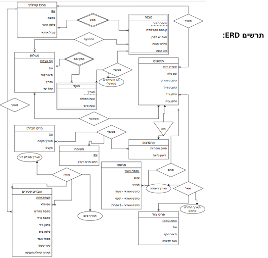

# Community Center Database Management System

## 📌 Project Overview
This project is an end-to-end relational database designed for "Mehuvarim" (Connected), a non-profit organization operating a national network of community centers. The database provides a comprehensive solution for managing the organization's core operations, including resident registrations, volunteer assignments, community activities, equipment loans, and donations.

The project demonstrates the complete database development lifecycle: from business requirements and ERD modeling to schema creation (DDL) and complex analytical querying (DML).

## 🛠️ Tech Stack
* **Database Engine:** SQL Server (T-SQL)
* **Concepts:** Relational Database Design, Data Integrity, Advanced SQL Querying, Views, Stored Procedures.

## 📊 Database Schema (ERD)
The database structure is normalized (3NF) to ensure data integrity and reduce redundancy. 

## 💡 Key Features & Business Logic

### 1. Robust Data Integrity (DDL)
* Established strict relationships using Primary and Foreign Keys.
* Implemented `CHECK` constraints to validate data entry (e.g., ensuring valid phone number formats, email structures, and logical date hierarchies).

### 2. Volunteer Engagement Analysis
Developed queries utilizing `CASE` statements and `JOIN`s to categorize social projects based on volunteer participation levels (e.g., High, Moderate, Low Engagement). This helps the organization's management identify which initiatives require marketing boosts.

### 3. Targeted Audience Identification
Created a dynamic `VIEW` (`TargetedResidents`) to identify highly engaged residents (those who participate in activities, volunteer, and donate). This creates a targeted list for potential donor retention campaigns.

### 4. Resource & Equipment Optimization
Utilized subqueries and aggregation functions (`GROUP BY`, `COUNT`) to track equipment loans and identify the most active community centers and rooms, allowing the operations department to optimize physical resource allocation.

### 5. Resident Activity Summaries
Developed a `STORED PROCEDURE` (`GetResidentActivitySummary`) that accepts a resident's ID as a parameter and returns a complete profile of their engagement, including total activities, volunteer tasks, and equipment loans.

## 📂 Repository Structure
* `/docs` - Contains the original business case requirements and the complete ERD diagram.
* `/src/schema.sql` - DDL scripts for creating tables and defining relationships/constraints.
* `/src/queries.sql` - DML scripts including complex data retrieval, Views, and Stored Procedures.

## ✉️ Contact
**Noam Paz**
* LinkedIn: www.linkedin.com/in/noam-paz3
* Email: noampaz3@gmail.com